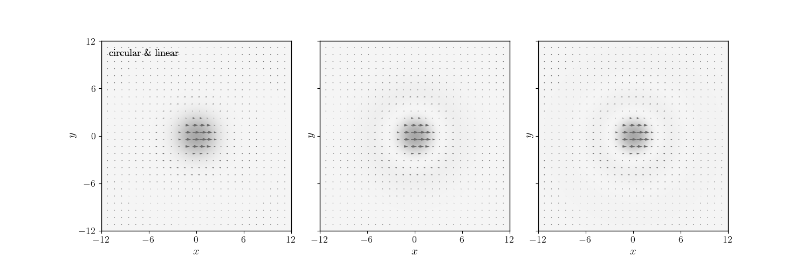
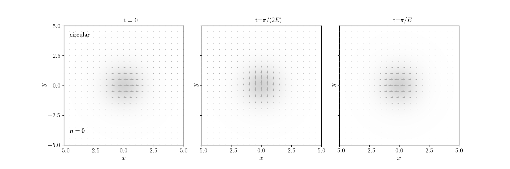

# Nonrelativistic Proca Stars

### Code and Explanations for *"Non-relativistic Proca Stars: Stationary and Multifrequency Solutions"*

---

## 📘 Introduction

This repository provides the code, numerical routines, and explanations accompanying the paper
**“Non-relativistic Proca Stars: Stationary and Multifrequency Solutions.”**

The work focuses on **nonrelativistic Proca stars**, i.e., self-gravitating condensates of **massive vector fields** in the Newtonian limit.
It studies the **stationary** and **multi-frequency** equilibrium configurations through an **effective field theory** approach.

---

## 🌌 Background

### Boson and Proca Stars

* **Boson Stars**: Stable, finite-energy configurations in theories of massive, self-gravitating **scalar fields**.
* **Proca Stars**: Vector-field analogs of boson stars, first introduced by Brito, Cardoso, Herdeiro, and Radu. They are solutions to the **Einstein–Proca equations**, encompassing static, spherically symmetric, and axially symmetric spacetimes.

This work extends the study of Proca stars to the **nonrelativistic regime**, where analytical control and numerical exploration are more tractable.

---

## 🪐 Motivation: Dark Matter and the Nonrelativistic Limit

* **Dark Matter Connection**: Massive vector fields ($spin = 1$) are promising candidates for **ultralight dark matter**, providing richer dynamics than scalar (spin = 0) axion-like models.
  These fields can form **self-gravitating halos** whose structure is predominantly Newtonian.

* **Nonrelativistic Description**:
  In this limit, Proca stars are described by a **vector-valued wave function** obeying the Schrödinger equation, with gravity determined by Poisson’s equation.
  Including self-interactions yields a **Gross–Pitaevskii–type system** with two couplings:
  
  $$\lambda_n, \quad \lambda_s$$

  * If $\lambda_n = \lambda_s = 0$): $s = 1$ *Schrödinger–Poisson system*
  * Otherwise: $s = 1$ *Gross–Pitaevskii–Poisson system*

  Finite-energy equilibrium configurations of these systems are termed **nonrelativistic Proca stars**.

---

## ⚖️ Classification of States

| Sector                                  | Description                                          | Type of Solutions                                         |
| --------------------------------------- | ---------------------------------------------------- | --------------------------------------------------------- |
| **Generic** $\lambda_s \neq 0$        | Wave function evolves harmonically in time           | Stationary (single-frequency) states                      |
| **Symmetry-Enhanced $\lambda_s = 0$** | Additional symmetry allows multiple time frequencies | Multifrequency states (two or three distinct frequencies) |

The paper demonstrates that for a fixed particle number, the **lowest-energy configuration** corresponds to a **stationary, spherically symmetric** state with **constant polarization** (linear or circular, depending on the sign of $\lambda_s$).

---

## 🔬 Numerical Methods and Findings

* Constructs **spherically symmetric stationary** and **multi-frequency** solutions numerically.
* Analyzes their **energies, density profiles, and polarization properties**.
* Shows that while stationary solutions form a **discrete spectrum**, the symmetry-enhanced sector admits a **continuum** of multi-frequency states connecting different stationary configurations.

A forthcoming paper will address the **linear stability** of these solutions.

---

---

## 📚 Reference

If you use this repository or its results in academic work, please cite:

> *Nonrelativistic Proca stars: Spherical stationary and multi-frequency states
> [Emmanuel Chávez Nambo, Alberto Diez-Tejedor, Edgar Preciado-Govea, Armando A. Roque, Olivier Sarbach]

---

## 📜 License

This project is licensed under the **MIT License** – see the [LICENSE](LICENSE) file for details.

---
